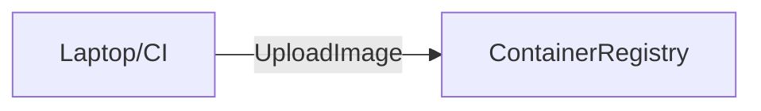
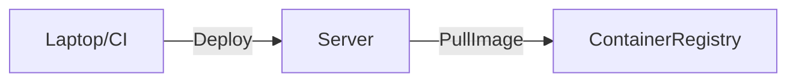

# [Kamal](https://github.com/basecamp/kamal), known and missing pieces

<!--
Today we will talk about about Kamal.
-->

---
theme: seriph
layout: image-left
image: https://source.unsplash.com/random/1920x1080/?belgrade
transition: fade-out
---

# Ivan Vandot

- from Belgrade
- glorified SysAdmin (DevOps, SRE etc)
- prefer simplicity
- all over Internet as `vandot`

<!--
Little bit about me
-->

---
theme: seriph
layout: image-right
image: https://source.unsplash.com/random/1920x1080/?compass,nautical
transition: fade-out
---

# Kamal, known and missing pieces

Kamal is a new deployment tool by 37signals for the container era
- **zero-downtime deployments**
- **rolling restarts**
- **asset bridging**
- **local and remote builds**
- **auxiliary services management**

<!--
Kamal, new deployment tool by 37signals for the container era. Kamal offers zero-downtime deploys, rolling restarts, asset bridging, local and remote builds, auxiliary services management, overal great tool for managing Docker in production.
Originally built for Rails apps, Kamal will work with any type of web app that can be containerized.
Later we will see how Kamal accomplishes all of these features.
-->

---
theme: seriph
---

# Philosophy

### Build and push the image


### Deploy the image to the server


<!--
Kamal uses push model to deploy code to the specified server or servers. But with Kamal, the code is not pushed to the server, but rather built as a container image, pushed to the remote registry, then servers are directed to pull and run the application using the new image.
Once the new revision is successfully running, old containers are stopped and previous image versions stay on the server for a possibility of a quick rollback.
-->

---
theme: seriph
layout: image-left
image: https://source.unsplash.com/random/1920x1080/?containers
transition: fade-out
---

# Components

- **SSHKit**
- **Docker**
- **Traefik**

<!--
Kamal relies on three battle tested and production ready technologies. This is the fact that I really like about Kamal, in the end is just a wrapper, really handy and useful but still just a wrapper around this 3 technologies. If something goes wrong it's really easy to debug and fix, not so many running pieces.
SSHKit is a Ruby interface for SSH allowing Kamal to run remote Docker commands, Kamal assumes SSH is configured and doesn’t configure the SSH access in any way.
Docker is a platform that allows developers to build, package, distribute, and run applications within isolated containers. Kamal uses Docker to run Traefik, your application, and its accessories.
Traefik is a dynamic reverse proxy and load balancer that is designed to work seamlessly with containerized environments. Kamal runs Traefik as a Docker container and uses Traefik for distributing web traffic to containers on the same server to achieve zero downtime deploys.
-->

---
theme: seriph
---

# Installation and initializations

## Install

```bash {2|5|8}
# as a Ruby gem
gem install kamal

# dockerized version mac
alias kamal='docker run -it --rm -v "${PWD}:/workdir" -v "/run/host-services/ssh-auth.sock:/run/host-services/ssh-auth.sock" -e SSH_AUTH_SOCK="/run/host-services/ssh-auth.sock" -v /var/run/docker.sock:/var/run/docker.sock ghcr.io/basecamp/kamal:latest'

# dockerized version linux
alias kamal='docker run -it --rm -v "${PWD}:/workdir" -v "${SSH_AUTH_SOCK}:/ssh-agent" -v /var/run/docker.sock:/var/run/docker.sock -e "SSH_AUTH_SOCK=/ssh-agent" ghcr.io/basecamp/kamal:latest'
```

## Init

```bash
kamal init
```
.env, .kamal/hooks/*, config/deploy.yaml

<!--
init command will generate couple of files
- .env
- .kamal/hooks/*
- config/deploy.yaml
-->

---
theme: seriph
layout: image-left
image: https://source.unsplash.com/random/1920x1080/?zero,number
transition: fade-out
---

# Zero-downtime deployments

**cord file**

#### Cord file mounted inside docker container
```
.kamal/cords/[SERVICE]-web-[HASH] -> /tmp/kamal-cord
```

#### Health command patched to check for cord file as well
```
... && (stat /tmp/kamal-cord/cord > /dev/null || exit 1)
```

<!--
Cord file is mounted inside docker container and health command is patched to check cord file as well
-->

---
theme: seriph
layout: image-right
image: https://source.unsplash.com/random/1920x1080/?deployment
transition: fade-out
---

# Deployment

## First time

```bash
kamal setup
```

- ensures Docker is installed
- pushes your environment from the environment files
- starts accessories like databases
- runs deploy step

## Second and beyond

```bash
kamal deploy
```

Or

```bash
kamal deploy --version=x.x.x --skip-push
```

<!--
ensures Docker is installed, if not it installs it
pushes your environment from the environment files including secrets
starts accessories like databases
runs deploy step

0. deploy lock is set
1. the requested version is tagged in Docker as :latest
2. new assets are extracted
3. asset volumes are synced
4. old version is renamed to [OLD_VERSION]_replaced_[HASH]
5. a cord is tied
6. the new version is run
7. the old version cord is cut
8. the old version is stopped
9. assets are cleaned up
10. deploy lock is removed
-->

---
theme: seriph
layout: image-left
image: https://source.unsplash.com/random/1920x1080/?tasks
transition: fade-out
---

# Tasks and destinations

Run tasks on service

```bash
kamal app exec --reuse "bin/rails about"

kamal app exec -i "bin/rails console"
```

Run tasks on accessory services

```bash
kamal accessory exec [NAME] [CMD]
```

A destination-specific configuration is at `config/deploy.[TARGET].yml`

```bash
kamal app exec --reuse "bin/rails about" -d staging
```

<!--
You can easily run arbitrary tasks
Diff destinations could be used for all kamal commands
-->

---
theme: seriph
layout: image
image: https://source.unsplash.com/random/1920x1080/?demo
transition: fade-out
---

<!--
Show the demo
-->

---
theme: seriph
layout: image-right
image: https://source.unsplash.com/random/1920x1080/?limitations
transition: fade-out
---

# Limitations

- can't run multiple applications on the same server
- doesn't know state of the servers
- multiple servers with HTTPS support

<!--
Backend and frontend. This can be technically done by managing Traefik from just one application configuration, but it’s not supported and not recommended.
Second, Kamal doesn’t know about the state of your servers beyond your configuration file. Because of this, you cannot count on Kamal to decommission containers if you delete them from the
configuration.
Official stand is that you should use some LB in front that has posibillity to terminate SSL, in the end you can always use Cloudflare. Problem is if you only have network LB and not able to use 3rd party LB like Cloudflare. There is an option by using Caddy as a accessory service with Redis backend.
-->

---
theme: seriph
layout: image
image: https://source.unsplash.com/random/1920x1080/?questions
transition: fade-out
---

<!--
Questions?
-->

---
theme: seriph
layout: end
background: https://source.unsplash.com/random/1920x1080/?end
transition: fade-out
---

<!--
End
-->
